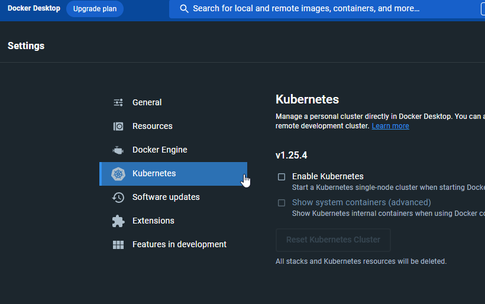
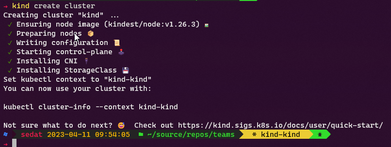
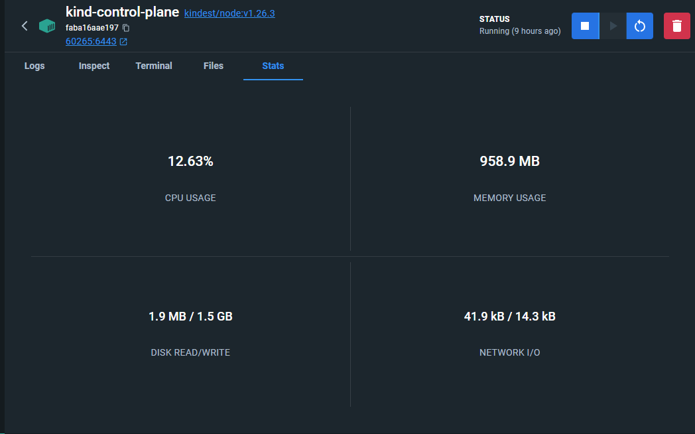
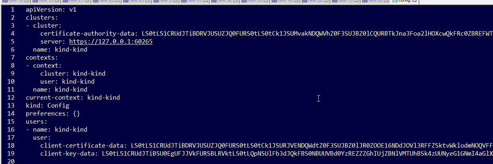

# kubernetes-basics
Temel hali ile Kubernetes nedir ve nasıl kullanılır. Örnekler ile birlikte anlatımı.
# K8s - Kubernetes Adı Nereden Gelir?
Kubernetes Yunanca dümenci, pilot demektir.  
K8s içindeki 8, K...s arasındanki harflerin sayısıdır.  
K8s Google içinde kullanılıyordu. 2014 yılında açık kaynak haline getirildi.

# Kubernetes (K8s) Nedir?
Uygulamalarımızı çalıştırdığımız kaynaklar önceleri fiziksel sunucular tarafından sağlanıyordur. Daha sonra bu kaynakların daha verimli kullanılabilmesi ve daha kolay yönetim olanakları için sanallaştırma
gündeme geldi. Günümüzde uygulama çeşitleri arttı ve her uygulamanın bu kaynaklara izole bir şekilde ulaşmasını sağlamak istersek çok sayıda VM gerekecektir. Buda kaynakların boşa harcanması anlamına gelir.

K8s, bir çok farklı tanım cümlesi bulabilirsiniz. K8s, bir konteyner orkestrasyon aracıdır.

Dağıtık bir uygulama ortamında çok fazla konfigürasyona ihtiyaç vardır:
- Uygulamalar özelliklerine göre farklı kurulum ve işletim ihtiyaçlarına sahiptir.
- Bir veritabanı uygulamasıiçin kalıcılık gereklidir.
- Bir web uygulaması hızlı ve dinamik ölçeklenebilmelidir.
- Dağıtık bir uygulama kümesinin parçaları diğer servislere kolay erişebilmeşdir.
- vb...

Bu ihtiyaçlar ile beraber birden çok sunucu ve bu uygulamaların birden çok kopyası olduğunda bu ortamı konfigüre etmek ve o konfigürasyonu en makul kaynak ile sürdürmek son derece zor bir denklem olur.

Örnek basit bir senaryo düşünelim, bir web uygulamamız olsun. Bu uygulamanın beş örneğinin aynı anda çalışmasını, herbirinin 2 Gb ram ve 2 Cpu kaynağa sahip olmasını istiyoruz.
Bunu 5 sanal makineyi bir LB arkasına alarak sağlayabiliriz. Bu sanal makinelerden biri düşerse yapmamız gerekenler yaklaşık olarak aşağıdaki gibidir:
- Yeni bir sanal makine oluşturmak
- Gerekli kurumsal diğer yazılımları (güvenlik vs..) kurmak
- Ağa dahil etmek
- Kendi uygulamalarımızı bu makine içine kurmak
- Ip adresini LB havuzuna eklemek
- vb... liste bir miktar daha uzayabilir

Tüm bunları çeşitli otomasyon araçları ile yapmak mümkündür. Düşünüyorum da, bu kadar basit bir uygulama için bile bu araçları tetiklemek, sonuçları kontrol etmek maliyetli olur.

Bir de bu web uygulamasının mikroservis yönelimli bir mimaride olduğunu onlarca farklı API ve birden fazla farklı çeşit veritabanı ile çalıştığını, her bir API uygulamasının kendi içinde diğerlerini çağırabileceğini, veri tabanları dahil tüm bu diğer uygulamaların kendi içinde ölçeklenmesi gerektiğini, ek olarak kendi CPU ve RAM kaynaklarının izole olması gerektiğini düşünün.

Tüm bu ortamda düşen ve ya yeni eklenen bir sunucunu için ağ, disk, sanal ortam, işletim sistemi gibi bir çok farklı düzeyde çok karmaşık ayarlar yapmak gerekir.
Uygulamalarınızın değişen ve ya eklenen IP adresleri gibi yeni konfigurasyonlara  adapte olabilmesi için gerekli daha başka bir çok ayar yapılmalıdır.

Kubernetes tüm bunları hiç bir müdehale gerektirmeden yapar. Öyleki sizin bir yerden bir şey başlatmanıza da gerek yoktur. Kendi kendini tetikler.

**K8s'in temel görevi ona verilen konfigürasyonu (desired state) korumaktır.**

Yani, bir uygulamanın 5 örnek çalışmasını istediğinizi belirtirseniz ve bir örneğin yer aldığı düğüm (sunucu) bir nedenden dolayı düşerse; K8s, bu uygulamanın bir örneğini diğer tüm ayarlarla birlikte küme içinde kaynak olan başka bir sunucuda ayağa kaldırır. Tüm ağ, disk vb... gibi ayarları yapar. Bu uygulamayı eskisi ile aynı şekilde ulaşılabilir yapar. 

Başka bir örnekte, deployment içinde uygulamanızın ihtiyaç duyduğu hafızayı 2gb olarak 
belirttiniz ve K8s den bu uygulamanın bir örneğini daha oluşturmasını istediniz. K8s, küme içindeki kaynakları en uygun düğümü (node) bulur ve uygulamayı oraya yerleştirir. Aynı şekilde düğüm yerleşmiş olan diğer uygulamaların RAM sorunu yaşamasına izin vermez. Bu CPU içinde bu şekildedir.

Bunlar sadece K8s in temel görevini anlatabilmek için bir kaç örtekti. Çok daha karmaşık işler gerçekleştirebilir.

# Nasıl Yönetilir?
Kubernetes kurulum ile birlikte standart olarak bir kontrol paneline sahiptir. [https://kubernetes.io/docs/tasks/access-application-cluster/web-ui-dashboard/](https://kubernetes.io/docs/tasks/access-application-cluster/web-ui-dashboard/). **kubectl**, Kubernetes'in kendi yayınladığı CLI aracıdır. Yönetim, izleme ile ilgili tüm olanaklar bu panel ve *kubectl* tarafından sağlanır.

Ayrıca çok sayıda diğer tarafların ürettiği yetenkli yönetim ve izleme araçları vardır. Genelde bunlar tercih edilir. **Lens**'e bir bakın [https://k8slens.dev/](https://k8slens.dev/).

Gerekli ayarlar *kubectl* yolu ile komut satırından yapılabilir. Genelde ayarları *yaml* formatında yazıp saklarız. Bu şekilde süreklilik sağlanabilir. Diğer bir taraftan CI/CD araçları ile entegre ederek **DevOps** süreçlerinde bütünlük sağlanır.

Ayrıca *Rancher* gibi güçlü K8s yönetim araçları vardır. Bu gibi araçlar canlı ortalar için kümeler kurmanızı ve yönetmenizi kolaylaştırır.

Bulut sağlayıcıları ve yerel veri merkezleri ile aynı anda (Multi Cluster Management) çalışmanızı sağlar. *OpenShift* buna bir diğer örnektir. OpenShift'in bir farkı Kubernetes'i olduğu gibi içermez. IBM burada kendi yönettiği bir Kubernetes yayınlar. Rancher gibi olanlar ise doğal Kubernetes versiyonunu dağıtır.

Rancher, OpenShift, VMWare Tanzu bilindik K8s yönetim araçlarıdır.

# Temel Bileşenler
K8s dünyasında çok çeşitli bileşenler vardır. Aşağıda bir uygulama yayınlayıp bunu küme dışından erişilebilir yapmak için gerekli olan temel bileşenlere göz atacağız.

# Node
Küme içindeki sunucu kaynaklarına düğüm (node) denir. Kümeye eklediğimiz her bir sunucu üzerine pod yerleşebilen yeni bir düğüm olur. K8s içindeki düğümlerin farklı görevleri vardır:

## etcd Role
Kubernetes'in veri tabanıdır. Küme ilgili tüm veri bu veri tabanında saklanır. Key/Value şeklinde bir veritabanıdır.

## controlplane Role
Kümenin genel işleyişi ile ilgili bileşenleri barındıran düğümlerdir.

## worker Role
Bizim uygulalarımızı barındıran düğümlerdir. Her kümede en az bir tane worker düğüm (node) bulunur. Küme bileşenleri ile ilgili daha fazla bilg için: [https://kubernetes.io/docs/concepts/overview/components/](https://kubernetes.io/docs/concepts/overview/components/)

# Container
CPU, RAM, işlem kapasitesi gibi kaynakların izole olmasını sağlar. Bir pod içinde birden fazla konteyner olabilir. Bir konteynerin birden fazla farklı kopyası farklı düğümlerde çalışabilir. Yani tekrar edilebilir. Bu sayede aynı uygulama farklı düğümlerde veya aynı düğüm üzerinde çoklanabilir. Ancak tamamen yeni bir örnek olarak diğerinden bağımsızdır. 

Konteyner mutlaka bir pod kapsamında olmalıdır. 

Konteynerler konteyner imajından oluşur. Ve bir "container runtime" tarafından çalıştırılır. Detay için [https://kubernetes.io/docs/concepts/containers/](https://kubernetes.io/docs/concepts/containers/) bakınız.

# Pod
Mantıksal bir kavramdır. Birden fazla konteyner barındırabilir. Her bir konteyner kendi içinde izole olsada bir pod içindeki bir konteyner diğerine *localhost* olarak erişebilir.

# Workload
Kavramsal bir bileşendir. Deployment bir workload türüdür. Deployment gibi StatefulSets, DaemonSet, ReplicaSet vb... iş yükü (workload) türleri vardır.

Genellikle "deployment" türünde iş yükleri oluşturulur. Ancak uygulamanın özelliklerine göre doğu tip seçilmelidir. Örnek olarak veri tabanı uygulamaları için "StatefulSets" daha uygun olabilir. Detaylı bilgi için [https://kubernetes.io/docs/concepts/workloads/controllers/](https://kubernetes.io/docs/concepts/workloads/controllers/) bakınız.

# Deployment
Bir iş yükü (workload) kaynağıdır. Uygulamamızın çalışması için gerekli konfigürasyonu (desired state) "deployment" ile tanımlarız.

Örnek olarak uygulamanın konteyner imajı, kaç örnek (replica) olarak çalışacağı vb... tüm ayarlar "deployment" ile bildirilir. K8s bu ayarları korur. Bir nedenden dolayı çalışma anında bu ayarlara aykırı bir durum olursa otomatik olarak bu ayarları yeniden yapmaya çalışır.

# Service
Bir veya daha fazla "pod" içinde çalışan uygulamamızın ağ üzerinde erişilebilir olmasını sağlar.

K8s içindeki podlar kalıcı değildir. Yani diske veri yazarlarsa bu veri pod sildiğinde kaybolur. Aynı şekilde poda atanan IP adresi de kalıcı değildir ve değişir. Bu işlem kube-proxy tarafından yönetilir. Uygulamamıza küme içindeki başka bir uygulamadan veya küme dışından erişilmesini sağlamak için servis tanımları oluşturmak gerekir.

Farklı türde servisler vardır. ClusterIP, NodePort vb... Servisler bir proxy gibi çalışır. Servisler gelen istekleri *kube-proxy* tarafından yönetilen bir algoritmaya göre podlara dağıtırlar. Detaylar için (https://kubernetes.io/docs/concepts/services-networking/service/)[https://kubernetes.io/docs/concepts/services-networking/service/]

# Ingress
Http(https) isteklerinin yönlendirme tanımlarının yapılmasını sağlar. Servis port ve IP ile çalışır. Bundan dolayı çok fazla farklı URI'ı farklı uygulamalara yönlendirmek gerektiğinde
çok sayıda IP adresi gerekir. Bu verimli bir çözüm değildir. Servis kullanmak yerine ingress kuralları oluşturulur. Örnek olarak;  
xyz.com -> A uygulaması,  
xyz.com/b -> B uygulaması,  
sub.xyz.com -> C uygulaması,  
abc.com -> D uygulaması  
gibi farklı konfigürayonlar ile isteklerin yönlendirmesi yapılabilir. Ingress kuralları sadece http(s) için çalışır. Ingress kurallarının yapabilecekleri kullanılan **Ingress Controller**'a göre değişir.

# Ingress Controller
Ingress kurallarını çalıştırmak için küme içine bir ingress kontroller kurulur. Kubernetes ile uyumlu çeşitli ingress controllerlar vardır. Başka bir değişle ingress kuralları kendi başına çalışmaz. Onları çalıştıracak bir *ingress controller* gereklidir. Bu sayfadan kubernetes ile uyumlu ingress controllerların listesine ulaşabilirsiniz. (https://kubernetes.io/docs/concepts/services-networking/ingress-controllers/)[https://kubernetes.io/docs/concepts/services-networking/ingress-controllers/]

# Labels & Selectors
Etiketler (labels) key/value değerleridir. Bir bileşene (Örnek bir "deployment" tanımına) atanırlar. Bu sayede seçiciler (selectors) bu bileşeni bulabilirler.

Örnek; bir API uygulamasını küme içinde yayınlamak isteyelim. Bunun için bir deployment oluşturulur. Eğer bu uygulamaya erişmek istersek bir servis tanımı oluşturmalıyız. Bu servis tanımı hangi deployment için çalışacağını bilmelidir. Bunun için deploymen tanımlanırken bir etiket (label), servis tanımlanırken ise bir seçici (selector) belirtilir.
Bu sayede servis gerekli konfigürasyonu hangi deployment için yapacağını bilir. Aşağıda bir servis ve deployment yaml dosyalarında örnekler görebiliriz.

# Cluster Oluşturma
[**Kind**](https://kind.sigs.k8s.io/) ile kendi bilgisayarımızda bir K8s kümesi (cluster) oluşturabiliriz. Bu tek düğümlük (node) bir küme (cluster) olur. Yani tüm düğüm görevleri (**etcd**, **master**, **worker**) tek bir düğümde toplanır. Hali ile canlı bir ortam için uygun olmadığı bellidir. *Kind*, *Docker* ile çalışır. Yani öncesinde Docker kurulu ve çalışıyor olmalıdır. Aslında **Docker Desktop** ile birlikte Kubernetes kurma özelliği gelir.

Ancak **Kind** platform bağımsız ve oldukça kolaydır. Yani Kind ile ilerleyelim.

Kind kurulum yöntemleri için [https://kind.sigs.k8s.io/docs/user/quick-start/](https://kind.sigs.k8s.io/docs/user/quick-start/)

Ben **go** paket yöneticisi ile kurulum yaptım. Bu şekilde devam etmek isterseniz Docker haricinde **go** kurulu olmalıdır. Go kurulum için [https://go.dev/doc/install](https://go.dev/doc/install)

Daha sonra aşağıdaki gibi kind kurulur. Bu işlem Kind CLI uygulamasını *go* *bin* klasörüne ekleyecektir.

    go install sigs.k8s.io/kind@v0.18.0

Yukarıda bahsedildiği gibi bir küme kurmak için aşağıdaki komut yeterlidir: 

    kind create cluster

# kubectl Kurulumu
K8s yönetimini kubectl CLI ile yapabiliriz. Bunun için kubectl kurmak gereklidir. Farklı işletim sistemleri için **kubectl** mevcuttur. [https://kubernetes.io/docs/tasks/tools/](https://kubernetes.io/docs/tasks/tools/). Bu sayfalarda detaylı olarak anlatılmaktadır.

# kubectl ile Çalışma
**kubectl** kurulup PATH içine eklendikten sonra sistemimizde tanımlı olan kümeler (cluster) hakkında  bilgi alabiliriz.

    kubectl config get-clusters

Bu işlem aşağıdaki çıktıyı verir:

    NAME
    kind-kind

Sistemimizde erişebileceğimiz ismi kind-kind olan bir küme var. Geçerli olan kümenin hangisi olduğunu sorgulamak için aşağıdaki komut çalıştırılır:

    kubectl config current-context

Bu işlem aşağıdaki çıktıyı gösterir:

    kind-kind

Bunun anlamı ise; eğer bir *kubectl* komutu çalıştırırsak bu komutun etkileyeceği küme *kind-kind* kümesidir.

>Dikkat !!! Yerel makinemizde birden fazla kümeye erişim yetkisi tanımlı olabilir. İstenmeyen durumlar oluşmaması için hangi küme üzerinde işlem yaptığımızdan emin olmalıyız.

Bunu `kubectl config current-context` komutu ile öğrenebiliriz.

Küme içinde var olan podları listelemek için aşağıdaki komut çalıştırılır.

    kubectl get pods

Eğer benim gibi kind ile yeni bir cluster kurduysanız bu aşağıdaki çıktıyı verir.

    No resources found in default namespace.

Burada **namespace** ifadesine dikkat edelim. K8s içindeki bileşenler bir namespace'e atanır. Yani her bileşenin bir namespace'i vardır.

Biz yukarıdaki gibi (`kubectl get pods`) sorgulama yaptığımızda bir namespace adı vermedik. Bundan dolayı varsayılan namespac sorgulandı. Eğer aradığımız podlar farklı bir namespace'e atanmış olsaydı onları göremeyecektik.

Namespace listesini görmek için:

    kubectl get ns

Aşağıdaki çıktıyı verir:

    NAME                 STATUS   AGE
    default              Active   9h
    kube-node-lease      Active   9h
    kube-public          Active   9h
    kube-system          Active   9h
    local-path-storage   Active   9h

*kube-system* namespace'inde yer alan podları sorgulamak için:

    kubectl get pods -n kube-system

Aşağıdaki çıktıyı verir:

    NAME                                         READY   STATUS    RESTARTS   AGE
    coredns-787d4945fb-m7vwq                     1/1     Running   0          9h
    coredns-787d4945fb-tb4ck                     1/1     Running   0          9h
    etcd-kind-control-plane                      1/1     Running   0          9h
    kindnet-ps89h                                1/1     Running   0          9h
    kube-apiserver-kind-control-plane            1/1     Running   0          9h
    kube-controller-manager-kind-control-plane   1/1     Running   0          9h
    kube-proxy-69gq2                             1/1     Running   0          9h
    kube-scheduler-kind-control-plane            1/1     Running   0          9h

Görüldüğü gibi çalışan bir çok pod var. Bunlar K8s düğümünün çalışması için gerekli podlardır.

**kubectl**, bağlantı için gerekli bilgileri "kubeconfig" doyasından alır. Bu, Windows için `C:\Users\<username>\.kube` klasöründeki `config` isimli dosyasır. Örnek bir config dosyası:

# Yeni Bir Uygulamayı Kubernetes'te Yayınlama
Bir ASP.Net uygulaması geliştirelim. Docker ile konteyner imajını oluşturalım ve Kubernetes'te yayınlayalım.