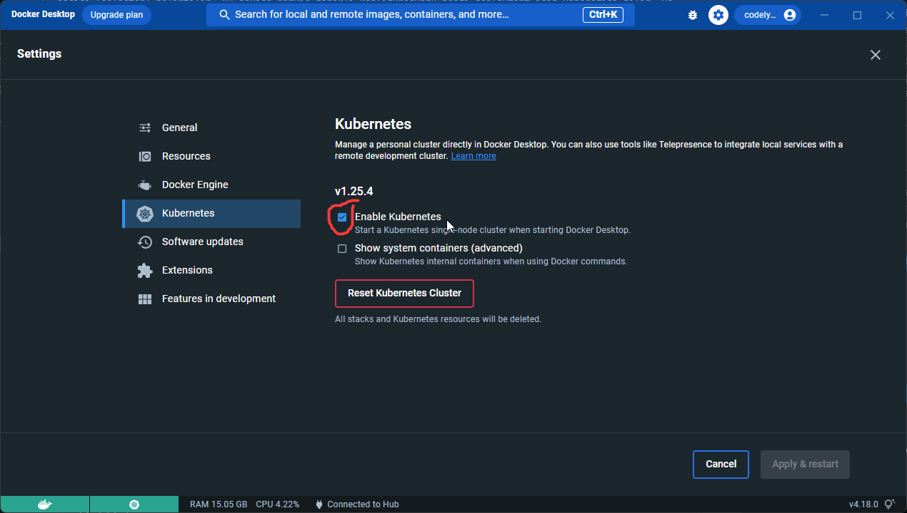
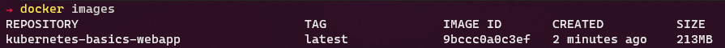
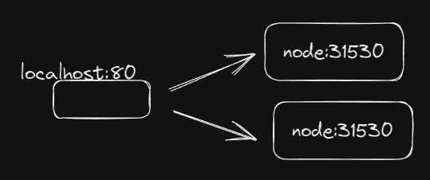
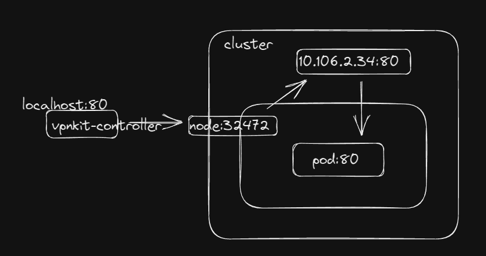
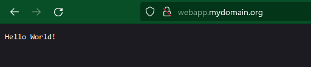

# kubernetes-basics
Kubernetes nedir ve nasıl kullanılır? Öne çıkan kavramlar/bileşenler nelerdir ve ne için kullanılırlar? Bu gibi konuları açıklayıp kendi bilgisayarımızda bir K8s kümesi ayağa kaldıracağız. Son olarak bir ASP.Net uygulamasını K8s kümesinde yayınlayıp gerekli ağ ayarlarını yapacağız ve uygulamayı küme dışından erişilebilir hale getireceğiz.

# K8s - Kubernetes Adı Nereden Gelir?
Kubernetes Yunanca dümenci, pilot demektir.  
K8s içindeki 8, K...s arasındanki harflerin sayısıdır.  
K8s Google içinde kullanılıyordu. 2014 yılında açık kaynak haline getirildi.

# Kubernetes (K8s) Nedir?
Uygulamalarımızı çalıştırdığımız kaynaklar önceleri fiziksel sunucular tarafından sağlanıyordu. Daha sonra bu kaynakların daha verimli kullanılabilmesi ve daha kolay yönetim olanakları için sanallaştırma
gündeme geldi. Günümüzde uygulama çeşitleri arttı. Her uygulamanın bu kaynaklara izole bir şekilde ulaşmasını sağlamak istersek çok sayıda VM gerekir. Bu da kaynakların boşa harcanması anlamına gelir.

>K8s için bir çok farklı tanım cümlesi bulabilirsiniz. K8s, bir konteyner orkestrasyon aracıdır.

Dağıtık bir uygulama ortamında çok fazla konfigürasyona ihtiyaç vardır:
- Uygulamalar özelliklerine göre farklı kurulum ve işletim ihtiyaçlarına sahiptir
- Bir veritabanı uygulaması için kalıcılık gereklidir
- Bir web uygulaması hızlı ve dinamik ölçeklenebilmelidir
- Dağıtık bir uygulama kümesinin parçaları diğer servislere kolay erişebilmeşdir
- vb...

Bu ihtiyaçlara ek olarak bir de birden çok sunucu ve bu uygulamaların birden çok kopyası olduğunda, bu ortamı konfigüre etmek ve o konfigürasyonu en makul kaynak ile sürdürmek son derece zor bir denklem olur.

Örnek basit bir senaryo düşünelim, bir web uygulamamız olsun. Bu uygulamanın beş örneğinin aynı anda çalışmasını, herbirinin 2 Gb ram ve 2 Cpu kaynağa sahip olmasını istiyoruz. Bunu 5 sanal makineyi bir LB arkasına alarak sağlayabiliriz. Bu sanal makinelerden biri düşerse yapmamız gerekenler yaklaşık olarak aşağıdaki gibidir:
- Yeni bir sanal makine oluşturmak
- Gerekli kurumsal diğer yazılımları (güvenlik vs..) kurmak
- Ağa dahil etmek
- Kendi uygulamalarımızı bu makine içine kurmak
- Ip adresini LB havuzuna eklemek
- vb... liste bir miktar daha uzayabilir

Tüm bunları çeşitli otomasyon araçları ile yapmak mümkündür. Düşünüyorum da, bu kadar basit bir uygulama için bile bu otomasyon araçlarını tetiklemek, sonuçları kontrol etmek bir hayli maliyetli olur.

Bir de bu web uygulamasının mikroservis yönelimli bir mimaride olduğunu, onlarca farklı API ve birden fazla farklı çeşit veritabanı ile çalıştığını, her bir API uygulamasının kendi içinde diğerlerini çağırabileceğini, veri tabanları dahil tüm bu diğer uygulamaların kendi içinde ölçeklenmesi gerektiğini, ek olarak kendi CPU ve RAM kaynaklarının izole olması gerektiğini düşünün.

Tüm bu ortamda düşen ve ya yeni eklenen bir sunucunu için ağ, disk, sanal ortam, işletim sistemi gibi bir çok farklı düzeyde çok karmaşık ayarlar yapmak gerekir. Uygulamalarınızın değişen ve ya eklenen IP adresleri gibi yeni konfigurasyonlara  adapte olabilmesi için gerekli daha başka bir çok ayar da ayrıca yapılmalıdır.

İşte Kubernetes burada devreye girer ve tüm bunları hiç bir müdehale gerektirmeden yapar. Öyleki sizin bir yerden bir şey başlatmanıza da gerek yoktur. Kendi kendini tetikler.

>**K8s'in temel görevi ona verilen konfigürasyonu (desired state) korumaktır.**

Yani, bir uygulamanın 5 örnek çalışmasını istediğinizi belirtirseniz ve bir örneğin yer aldığı düğüm (sunucu) bir nedenden dolayı düşerse; K8s, bu uygulamanın bir örneğini diğer tüm ayarlarla birlikte küme içinde kaynak olan başka bir sunucuda ayağa kaldırır. Tüm ağ, disk vb... gibi ayarları yapar. Bu uygulamayı eskisi ile aynı şekilde ulaşılabilir yapar. 

Başka bir örnekte ise, deployment içinde uygulamanızın ihtiyaç duyduğu hafızayı 2gb olarak 
belirttiniz ve K8s den bu uygulamanın bir örneğini daha oluşturmasını istediniz. K8s, küme içindeki kaynakları en uygun düğümü (node) bulur ve uygulamayı oraya yerleştirir. Aynı şekilde düğüme yerleşmiş olan diğer uygulamaların RAM sorunu yaşamasına izin vermez. Bu CPU içinde geçerlidir.

Bunlar sadece K8s in temel görevini anlatabilmek için iki örtekti. Çok daha karmaşık işler gerçekleştirebilir ve ağ, disk, ram, cpu vb... gibi ayarları istenen şekilde korumak için kümeyi her zaman kontrol altında tutar.

# Nasıl Yönetilir?
Kubernetes kurulum ile birlikte standart olarak bir kontrol paneline sahiptir. [https://kubernetes.io/docs/tasks/access-application-cluster/web-ui-dashboard/](https://kubernetes.io/docs/tasks/access-application-cluster/web-ui-dashboard/). **kubectl** ise Kubernetes'in kendi yayınladığı CLI aracıdır. Yönetim, izleme ile ilgili tüm olanaklar bu panel ve *kubectl* tarafından sağlanır.

Ayrıca çok sayıda, diğer tarafların ürettiği yetenkli yönetim ve izleme araçları vardır. Genelde bunlar tercih edilir. **Lens**'e bir bakın [https://k8slens.dev/](https://k8slens.dev/).

Gerekli ayarlar *kubectl* yolu ile komut satırından yapılabilir. Genelde ayarları *yaml* formatında yazıp saklarız. Bu konfigürasyonlar bir kod repositorisi içinde saklanırsa süreklilik sağlanabilir. Ayrıca CI/CD araçları ile entegre ederek **DevOps** süreçlerinde bütünlük sağlanır.

Bunlara ek olarak *Rancher* gibi güçlü K8s yönetim araçları vardır. Bu gibi araçlar canlı ortalar için kümeler kurmanızı ve yönetmenizi kolaylaştırır. Bulut sağlayıcıları ve yerel veri merkezleri ile aynı anda (Multi Cluster Management) çalışmanızı sağlar. *OpenShift* buna bir diğer örnektir. OpenShift'in bir farkı Kubernetes'i olduğu gibi içermez. IBM kendi yönettiği bir Kubernetes yayınlar. Rancher gibi olanlar ise doğal Kubernetes versiyonunu dağıtır. *Rancher*, *OpenShift*, *VMWare Tanzu* bilindik K8s yönetim araçlarıdır. Burada [Canonical *microk8s*](https://microk8s.io/)'i söylemeden geçemem.

# Temel Bileşenler
K8s dünyasında çok çeşitli bileşenler vardır. Aşağıda ise bir uygulama yayınlayıp bunu küme dışından erişilebilir yapmak için gerekli olan temel bileşenlere göz atacağız.

## Node
Küme içindeki sunucu kaynaklarına düğüm (node) denir. Kümeye eklediğimiz her bir sunucu, üzerine pod yerleşebilen yeni bir düğüm olur. K8s içindeki düğümlerin farklı görevleri vardır:

### etcd Role
Kubernetes'in veri tabanıdır. Küme ile ilgili tüm veri bu veri tabanında saklanır. Key/Value şeklinde bir veritabanıdır.

### controlplane Role
Kümenin genel işleyişi ile ilgili bileşenleri barındıran düğümlerdir.

### worker Role
Bizim kendi uygulalarımızı barındıran düğümlerdir. Her kümede en az bir tane worker düğüm (node) bulunur. Küme bileşenleri ile ilgili daha fazla bilg için https://kubernetes.io/docs/concepts/overview/components/ sayfasına bakabilirsiniz.

## Container
CPU, RAM, işlem kapasitesi gibi kaynakların izole olmasını sağlar. Bir pod içinde birden fazla konteyner olabilir. Bir konteynerin birden fazla farklı kopyası farklı düğümlerde çalışabilir. Yani tekrar edilebilir. Bu sayede aynı uygulama farklı düğümlerde veya aynı düğüm üzerinde çoklanabilir. Ancak tamamen yeni bir örnek olarak diğerinden bağımsızdır. 

>Konteyner mutlaka bir pod kapsamında olmalıdır. 

Konteynerler konteyner imajından oluşur. Ve bir "container runtime" tarafından çalıştırılır. Detay için https://kubernetes.io/docs/concepts/containers/ sayfasına bakınız.

## Pod
Mantıksal bir kavramdır. Birden fazla konteyner barındırabilir. Her bir konteyner kendi içinde izole olsada bir pod içindeki bir konteyner diğerine *localhost* olarak erişebilir.

## Workload
Deployment bir workload türüdür. Deployment gibi StatefulSets, DaemonSet, ReplicaSet vb... iş yükü (workload) türleri vardır.

Genellikle "deployment" türünde iş yükleri oluşturulur. Ancak uygulamanın özelliklerine göre doğu tip seçilmelidir. Örnek olarak veri tabanı uygulamaları için "StatefulSets" daha uygun olabilir. Detaylı bilgi için https://kubernetes.io/docs/concepts/workloads/controllers/ sayfasına bakınız.

## Deployment
Bir iş yükü (workload) kaynağıdır. Uygulamamızın çalışması için gerekli konfigürasyonu (desired state) *deployment* ile tanımlarız.

Örnek olarak; uygulamanın konteyner imajı, kaç örnek (replica) olarak çalışacağı vb... tüm ayarlar *deployment* ile bildirilir. K8s bu ayarları korur. Bir nedenden dolayı çalışma anında bu ayarlara aykırı bir durum oluşursa otomatik olarak bu ayarları yeniden yapmaya çalışır.

## Service
Bir veya daha fazla "pod" içinde çalışan uygulamamızın ağ üzerinde erişilebilir olmasını sağlar.

K8s içindeki podlar kalıcı değildir. Yani diske veri yazarlarsa bu veri pod sildiğinde kaybolur. Aynı şekilde poda atanan IP adresi de kalıcı değildir ve değişir. Bu işlem kube-proxy tarafından yönetilir. Uygulamamıza küme içindeki başka bir uygulamadan veya küme dışından erişilmesini sağlamak için *Service* tanımları oluşturmak gerekir.

Farklı türde servisler vardır. ClusterIP, NodePort vb... Servisler bir proxy gibi çalışır. Servisler, gelen istekleri *kube-proxy* tarafından yönetilen bir algoritmaya göre podlara dağıtırlar. Detaylar için bu sayfaya bakabilirsiniz: https://kubernetes.io/docs/concepts/services-networking/service/

## Ingress
Http(https) isteklerinin yönlendirme tanımlarının yapılmasını sağlar. Servis ile farkını özetlemek gerekirse; servis port ve IP ile çalışır. Bundan dolayı çok fazla farklı URI'ı farklı uygulamalara servis ile yönlendirmek gerektiğinde çok sayıda IP adresi gerekir. Bu verimli bir çözüm olmaktan çok uzaktır. Servis kullanmak yerine *Ingress* kuralları oluşturulur. Örnek olarak;  
xyz.com -> A uygulaması,  
xyz.com/b -> B uygulaması,  
sub.xyz.com -> C uygulaması,  
abc.com -> D uygulaması  
gibi farklı konfigürayonlar ile isteklerin yönlendirmesi yapılabilir. Ingress kuralları sadece http(s) için çalışır. Ingress kurallarının yapabilecekleri kullanılan **Ingress Controller**'a göre değişir.

## Ingress Controller
Kubernetes yalın hali ile Ingress kurallarını çalıştıramaz. Ingress kurallarını çalıştırmak için küme içine bir ingress kontroller kurulur. Kubernetes ile uyumlu çeşitli ingress controllerlar vardır. https://kubernetes.io/docs/concepts/services-networking/ingress-controllers/ adresinden Kubernetes ile uyumlu ingress controllerların listesine ulaşabilirsiniz.

## Labels & Selectors
Etiketler (labels) key/value değerleridir. Bir bileşene (Örnek olarak bir "deployment" tanımına) atanırlar. Bu sayede seçiciler (selectors) bu bileşeni bulabilirler.

Örnek; bir API uygulamasını küme içinde yayınlamak isteyelim. Bunun için bir *Deployment* oluşturulur. Eğer bu uygulamaya erişmek istersek bir *Service* tanımı oluşturmalıyız. Bu servis tanımı hangi deployment için çalışacağını bilmelidir. Bunun için deploymen tanımlanırken bir etiket (label), servis tanımlanırken ise bir seçici (selector) belirtilir. Bu sayede servis gerekli konfigürasyonu hangi deployment için yapacağını bilir. Ve dahası küme içindeki hiç bir ağ, sistem değişikliğinden etkilenmeden yeni durumlara kendini adapte ederek bu uygulamalar için sürekli bir proxy oluşturur. Aşağıda servis ve deployment yaml dosyalarında bu konuda örnekler görebiliriz.

# Cluster Oluşturma
*Docker Desktop* kullanarak kendi bilgisayarımızda bir K8s kümesi (cluster) oluşturabiliriz. Docker tüm düğüm görevlerini (**etcd**, **master**, **worker**) sağlayan Docker konteynerleri ile bir K8s kümesi oluşturur. *Bu canlı bir ortam için uygun değildir.*

>Docker Desktop gibi [*Kind*](https://kind.sigs.k8s.io/) ile de geliştirme ortamı için bir kubernets düğümü kurulabilir. Kind oldukça kullanışlı bir araçtır.

# kubectl Kurulumu
K8s yönetimini kubectl CLI ile yapabiliriz. Bunun için kubectl kurmak gereklidir. Farklı işletim sistemleri için **kubectl** mevcuttur. Kurulum, https://kubernetes.io/docs/tasks/tools/ adresinde detaylı olarak anlatılmaktadır.

## kubectl ile Çalışma
**kubectl** kurulup PATH içine eklendikten sonra sistemimizde tanımlı olan kümeler (cluster) hakkında  bilgi alabiliriz.

    kubectl config get-clusters

Bu işlem aşağıdaki çıktıyı verir:

    NAME
    docker-desktop

Sistemimizde erişebileceğimiz ismi *docker-desktop* olan bir küme var. Geçerli olan kümenin hangisi olduğunu sorgulamak için aşağıdaki komut çalıştırılır:

    kubectl config current-context

Bu işlem aşağıdaki çıktıyı gösterir:

    docker-desktop

Bunun anlamı ise; eğer bir *kubectl* komutu çalıştırırsak bu komutun etkileyeceği küme *docker-desktop* kümesidir.

>Dikkat !!! Yerel makinemizde uzak production ortamları gibi birden fazla kümeye erişim yetkisi tanımlı olabilir. İstenmeyen durumlar oluşmaması için hangi küme üzerinde işlem yaptığımızdan emin olmalıyız.

Bunu `kubectl config current-context` komutu ile öğrenebiliriz.

Küme içinde var olan podları listelemek için aşağıdaki komut çalıştırılır.

    kubectl get pods

Eğer benim gibi bir yöntem ile yeni bir cluster kurduysanız bu aşağıdaki çıktıyı verir.

    No resources found in default namespace.

Burada **namespace** ifadesine dikkat edelim. K8s içindeki bileşenler bir namespace'e atanır. Yani her bileşenin bir alanı vardır.

Biz yukarıdaki gibi (`kubectl get pods`) sorgulama yaptığımızda bir namespace adı vermedik. Bundan dolayı varsayılan namespace sorgulandı. Eğer aradığımız podlar farklı bir alana atanmış olsaydı onları göremeyecektik.

Namespace listesini görmek için:

    kubectl get ns

Aşağıdaki çıktıyı verir:

    NAME              STATUS   AGE
    default           Active   10d
    ingress-nginx     Active   8d
    kube-node-lease   Active   10d
    kube-public       Active   10d
    kube-system       Active   10d

*kube-system* namespace'inde yer alan podları sorgulamak için:

    kubectl get pods -n kube-system

Aşağıdaki çıktıyı verir:

    NAME                                     READY   STATUS    RESTARTS        AGE
    coredns-565d847f94-97bxn                 1/1     Running   9 (79m ago)     10d
    coredns-565d847f94-jwljj                 1/1     Running   9 (79m ago)     10d
    etcd-docker-desktop                      1/1     Running   12 (79m ago)    10d
    kube-apiserver-docker-desktop            1/1     Running   12 (79m ago)    10d
    kube-controller-manager-docker-desktop   1/1     Running   12 (79m ago)    10d
    kube-proxy-2b29h                         1/1     Running   9 (79m ago)     10d
    kube-scheduler-docker-desktop            1/1     Running   12 (79m ago)    10d
    storage-provisioner                      1/1     Running   14 (79m ago)    10d
    vpnkit-controller                        1/1     Running   463 (37s ago)   10d

Görüldüğü gibi çalışan bir çok pod var. Bunlar K8s düğümünün çalışması için gerekli podlardır.

**kubectl**, bağlantı için gerekli bilgileri "kubeconfig" doyasından alır. Bu, Windows için `C:\Users\<username>\.kube` klasöründeki `config` isimli dosyasır. Örnek bir config dosyası:

# Yeni Bir Uygulamayı Kubernetes'te Yayınlama
Bir ASP.Net uygulaması geliştirelim. Docker ile konteyner imajını oluşturalım ve Kubernetes'te yayınlayalım.

`webapp` klasöründe bir ASP.Net web uygulaması bulunmaktadır. `Dockerfile` ile docker imajını oluşturalım. Bunun için:

    cd webapp
    docker build -t kubernetes-basics-webapp .
    docker images

Aşağıdaki gibi `kubernetes-basics-webapp` imajını listeliyor olmalı.

Uygulama `kube` klasöründe bulunan `deployment.yaml` ile kubernetes içinde yayınlanır. 

    apiVersion: apps/v1
    kind: Deployment
    metadata:
    name: webapp-deployment
    labels:
        app: webapp
    spec:
    replicas: 1
    selector:
        matchLabels:
        app: webapp
    template:
        metadata:
        labels:
            app: webapp
        spec:
        containers:
        - name: webapp
            image: kubernetes-basics-webapp
            ports:
            - containerPort: 80
            imagePullPolicy: IfNotPresent

Kubernetes varsayılan olarak imajları dockerhub'dan (imaj registry) alır. Dikkat ederseniz buradaki `kubernetes-basics-webapp` imajını dockerhub gibi bir imaj registry'ye `push` etmedik. Buna rağmen kubernetes bunu bulabiliyor. Docker Desktop `dockershim` sayesinde makinemizdeki docker imajlarına erişebilir.

`service.yaml` dosyası ile uygulamanın kubenetes dışından erişilebilir olması sağlanır.

    apiVersion: v1
    kind: Service
    metadata:
    name: webapp-service
    spec:
    type: NodePort
    selector:
        app: webapp
    ports:
        - port: 80
        targetPort: 80
        nodePort: 30007
    ---
    apiVersion: v1
    kind: Service
    metadata:
    name: webapp-lb-service
    spec:
    type: LoadBalancer
    selector:
        app: webapp
    ports:
    - port: 80
        targetPort: 80
    status:
    loadBalancer: {}

>Tek bir yaml dosyası ile birden fazla tanım yapılabilir. Her bir tanımı ayırmak için `---` eklenir.

Bu dosya içinde iki adet service tanımı bulunur. Son durumda `LoadBalancer` tipinde olanı kullanmak daha makuldür. Ancak şimdi bahsedeceğim bir durumu anlatabilmek için `NodePort` tipinde bir serviste ekledim.

Bu servis tanımlarını yaptıktan sonra uygulama local makinenin `80` ve `30007` portlarından erişilebilir olur. Yukarıda belirttiğim gibi tek bir tanım ile `80` üzerinden erişilebilir olaması yeterlidir. Docker Desktop kubernetes kurarken `storage-provisioner` ve `vpnkit-controller` adında iki operator kurulumu yapar. Bunlar Docker Desktop'a özeldir. `vpnkit-controller`, `LoadBalancer` tipinde servisin gerektiği gibi çalışmasını sağlar. Yalın bir kubernetes kurulumunda bu işi yapacak bir bileşen gelmez. Ve uygulamalarımıza dışarıdan erişebilmek için ek ağ bileşenleri ve ayarları yapılmalıdır. `vpnkit-controller` ise bu senaryoyu *local* makineden işletmek için çalışır.

Yukarıdaki resimde 2 node bulunmaktadır. Bağlantılar, `NodePort` ile bir servis oluşturduğumuzda küme içindeki her bir düğüm üzerinde belirttiğimiz port ile dinlenir. Ancak burada iki veya daha fazla node varsa istekler sürekli aynı düğüme gelmemeli ve düğümler arasında dağıtılmalıdır. Ek olarak bağlantılar K8s dahilindeki düğümlerin (node) ilgili portuna yönlendirilmelidir. Ancak Kubernetes bu dağıtım ve yönlendirme işini destekleyecek bileşenleri sağlamaz. Bu süreç kümenin dışında işler. Yani bu, Kubernetes'in etki alanı dışında kalır. Kubernetes bu durumu `LoadBalancer` adında farklı tipteki bir servis ile tanımlar. Ve işlemesi için LB cihazları, yazılımlar, yönlendiriciler vs... gibi ek bilşenler gerekir. Bu örnekte, *local* makinemizdeki Docker Desktop bunun için `vpnkit-controller` kullanır. Vpnkit, makinemizdeki VPN yapısına etki ederek bu örnekte host makinenin `80` portuna gelen istekleri küme düğümlerinin portlarına yönlendirir. Burada küme düğümleri için bir port belirlemedik. Çünkü `NodePort`, `30000-32767` aralığındaki bir portu otomatik olarak seçer ve kullanır. Yani `LoadBalancer` aslında `NodePort` gibi port açar ve `ClusterIp` gibi bir cluster IP adresi belirler. Bu durum bulunulan ortamdaki LB üzerinde, gerekli ayarları yapacak harici bir bileşene ihtiyaç ortaya çıkarır. AKS, GKE gibi bulut sağlayıcılarında bunu karşılayacak yapılar hazırda bulunur. On-prem bir senaryoda ise bu ayarlar harici olarak yapılmalıdır. Burada *Docker Desktop* bu işi bizim için yukarıda anlatıldığı gibi yapar.

Hatırlarsanız, örnekte `NodePort` tipinde de bir servis vardı. Dediğim gibi bu gerekli değil. Ancak uygulamanın `30007` portundan da erişebildiğini göstermek için ekledim. Dikkat ederseniz burada nodun portunu el ile vermeyi seçtim. Yani dilerseniz `30000-32767` arasındaki otomatik port seçiminin önüne geçip portu sabit atayabilirsiniz.

>*Kubernetes dışında bir LB kurun. Kubernetes içinde ise `NodePort` bir servis tanımlayın. Kubernetes worker düğümlerinin IP adreslerini LB deki sunucu havuzuna bu sabit atadışınız port ile ekleyin. Bu şekilde dışarıdan erişilebilir production için uygun bir küme elde edersiniz.*

Örneğimize dönersek ASP.Net uygulaması *http://loclahost* ve *http://localhost:30007* ile erişilebilir oldu.

Bunun dışında uygulamayı dış erişime açmanın bir diğer yolu ise *Ingress* tanımlarıdır. Sistemi Ingress ekleyerek daha da genişletelim.

# Ingress Kullanarak Erişim
*Ingress* kullanarak bir IP adresi ve Port ile çok sayıda uygulamaya erişim sağlayabiliriz. `Host` veya `Path` tabanlı kurallar oluşturarak farklı dış adreslerden kubernetes içindeki farklı  uygulamalara erişim sağlayabiliriz. Oluşturacağımız Ingress kurallarının çalışması için bir *Ingress Controller* kurulmalıdır. Bu örnekte [nginx](https://kubernetes.github.io/ingress-nginx/user-guide/nginx-configuration/) Ingress Controller kuracağız.

Docker Desktop için nginx ingress kurulumu [bu sayfada](https://kubernetes.github.io/ingress-nginx/deploy/#local-testing) anlatılmaktadır. Buna göre *kubectl* ile kurulum yapacağız.

>Önemli! Daha önce kurduğumuz `LoadBalancer` tipindeki servisi kaldırmalıyız. Nginx *80* portunu dinleyen `LoadBalancer` tipinde bir servis oluşturmaya çalışacak. Bu iki servis bir arada olamayacağından aşağıdaki komut ile diğer servisi silelim. Sileceğimiz servis *default* namespace içinde oluşmuştu.

    kubectl get svc

Aşağıdaki sonucu getirir.

    NAME                TYPE           CLUSTER-IP      EXTERNAL-IP   PORT(S)        AGE
    kubernetes          ClusterIP      10.96.0.1       <none>        443/TCP        2d1h
    webapp-lb-service   LoadBalancer   10.104.101.53   localhost     80:31530/TCP   24h
    webapp-service      NodePort       10.111.189.50   <none>        80:30007/TCP   24h

Servisi silmek için aşağıdaki komutu çalıştırın.

    kubectl delete svc webapp-lb-service

Bundan sonra nginx Ingress Controller kurulumunu yapabiliriz. *kubectl* ile kurmak için aşağıdaki komutu çalıştırın.

    kubectl apply -f https://raw.githubusercontent.com/kubernetes/ingress-nginx/controller-v1.7.0/deploy/static/provider/cloud/deploy.yaml

Bir süre sonra gerekli pod çalışıyor olmalıdır. Kontrol için:

    kubectl wait --namespace ingress-nginx --for=condition=ready pod --selector=app.kubernetes.io/component=controller --timeout=120s

Ve çalışan podları görmek için:

    kubectl get pods --namespace=ingress-nginx

Aşağıdaki sonucu verir:

    NAME                                        READY   STATUS      RESTARTS   AGE
    ingress-nginx-admission-create-74qbr        0/1     Completed   0          6m12s
    ingress-nginx-admission-patch-skckm         0/1     Completed   1          6m12s
    ingress-nginx-controller-7d9674b7cf-r6swf   1/1     Running     0          6m12s

Nginx tarafından oluşturulan *LoadBalancer* servisini görmek için:

    kubectl get svc -n ingress-nginx

Aşağıdaki sonucu verir:

    NAME                                 TYPE           CLUSTER-IP      EXTERNAL-IP   PORT(S)                      AGE
    ingress-nginx-controller             LoadBalancer   10.106.2.34     localhost     80:32472/TCP,443:32054/TCP   38m
    ingress-nginx-controller-admission   ClusterIP      10.105.38.150   <none>        443/TCP                      38m

Bu tanımlardan sonra oluşan durum aşağıdaki resimdeki gibidir.

Görüldüğü gibi `localhost` IP adresinde `80` portu düğüm (node) üzerindeki `32472` portuna yönlenmektedir. Küme içinde 10.106.2.34 IP adresine sahip servis ise `80` portuna gelen istekleri ilgili podun `80` portuna yönlendirmektedir. Bu şekilde dışarıdan yapılan istek konteynerin `80` portunu dinleyen uygulamamıza ulaşmaktadır.

Tüm bu ayarlar dinamiktir. Yani IP adresileri değişse bile yeni duruma adapte olur. *K8s sihiri...*

Bu aşamadan sonra web uygulamamızı küme dışından erişime açabilmek için küme üzerinde Ingress tanımı oluşturabiliriz.

    apiVersion: networking.k8s.io/v1
    kind: Ingress
    metadata:
    name: ingress-webapp
    spec:
    rules:
    - host: webapp.mydomain.org
        http:
        paths:
        - path: /
            pathType: Prefix
            backend:
            service:
                name: webapp-service
                port:
                number: 80
    ingressClassName: nginx

Nginx, `ingressClassName: nginx` direktifini gördüğünde bu Ingress tanımını kontrol etmek için tetiklenir. Bu tanım ile birlikte `webapp.mydomain.org` host header tanımı ile gelen isteklerin `webapp-service` servisine yönlendirilmesini söylüyoruz.

Burada eksik olan bir ayar daha var. *webapp.mydomain.org* *DNS A* tanımı ile birlikte ilgili IP adresine yönlendirilmelidir. Bunun yerine aşağıdaki tanımı *host* dosyasına girebiliriz.  

    127.0.0.1 webapp.mydomain.org

Artık tarayıcıyı açıp *http://webapp.mydomain.org* yazdığımızda aşağıdaki ekranı göreceğiz. Hepsi bukadar.

Kubernetes hakkında temel bilgiler veremeye çalıştım. K8s oldukça fazla detaya sahip bir araçtır. Fazla okumalı ve şüpheniz gerçek bir proje deneyimi edinmeye çalışmalısınız.